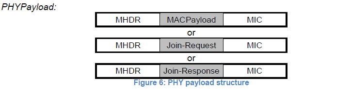
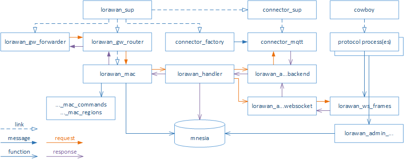
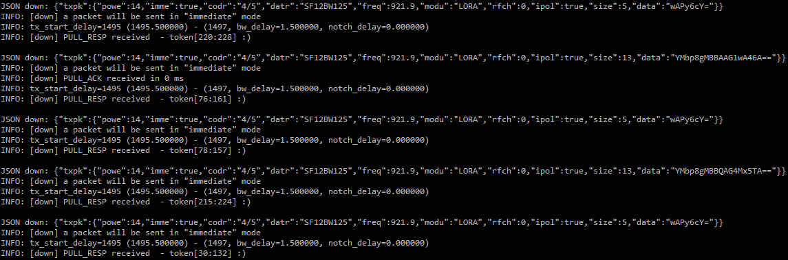
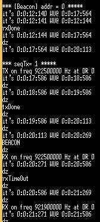

Final Report
---
> 박상혁, 노윤미


## Protocol

기존의 LoRaWAN Class A에, Server에서 donwlink를 개시할 수 있는 기능을 추가했다.
Server는 일정 시간마다 Beacon Frame을 broadcast한다. 이 Beacon Frame에는 어떤 Client가 downlink data를 받기 위해 radio를 열어야 하는지에 대한 정보가 들어있다.
해당하는 Client는 beacon을 받은 뒤 일정 시간 후에 radio를 열어야 한다.

### Beacon Interval

구현할 Server는 일정 시간마다 Beacon Frame을 broadcast할 것이다. 실험 결과 Gateway가 초당 1 packet 이상 잘 보내지지 않아서, Beacon Interval을 3000(ms)로 정했다.

### Beacon-transmit Interval

Server는 Beacon Frame을 broadcast하고 일정 시간 이후에 해당하는 Client로 downlink packet을 전송할 것이다. 역시 Gateway의 성능을 고려하여, 보수적으로 이 시간 간격을 1000(ms)로 정했다.

### Beacon Frame

Beacon은 자주 송수신되는 packet이므로, 최대한 간단해야 한다. 우리가 구현할 것은 MAC level의 protocol이기 때문에, PHYPayload를 잘 정의하면 된다.
기존의 PHYPayload는 MHDR의 종류에 따라 다음 3가지가 정의되어 있다.



MHDR의 앞 3bit는 MType이라 불리는데, 이 중 한 종류(`110`)는 RFU(Reserved for Future Usage)로 사용되지 않고 있다.
Beacon Frame의 MType을 이것으로 정의했으며, 나머지 bit는 0으로 정의했다. 즉, Beacon Frame의 MHDR(1byte)는 `11000000(2)`로 정의했다.

이어지는 Beacon Payload에서는 downlink를 받을 Client를 지정할 필요가 있다. Join과정 중 생성된 DevAddr(4byte)를 실어 보내기로 했다. 만약 보낼 packet이 없다면, 4byte의 0을 보낸다.

따라서 Beacon Frame은 다음과 같이 구성된다:
```
MHDR(1byte, 11000000) + Addr(4byte, DevAddr or 0)
```

### Timing, Datarate, Coding Rate, Frequency

위의 단락들에서 거의 설명했지만, 다시 설명하자면 Server는 3000ms마다 Beacon Frame을 broadcast하며, Beacon Frame transmit 1000ms 이후에 downlink data를 전송한다.
Downlink data, Beacon frame 모두 921.9MHz, Datarate "SF12BW125", Coding Rate "4/5"를 택했다.

---

## Server Implementation

기본적인 서버 코드의 구조는 다음 그림과 같다.


서버에서 추가로 구현해야 하는 것은 Beacon Frame Broadcast와, Downlink Data Unicast이다.
기본적으로, 다음과 같은 상수들을 `src/lorawan_server.app.src`에 추가했다.
```text
{beacon_freq, 921.9},
{beacon_interval, 3000},
{beacon_transmit_interval, 1000}
```

### Beacon Frame Broadcast
`erlang`의 `timer` library를 이용해 beacon frame broadcast를 구현했다. 코드 구조상 Gateway의 정보를 직접 다루는 `src/lorawan_gw_router.erl` 파일에 Beacon 전송을 구현하는 것이 좋다고 판단했다. 해당 파일의 `init/0` 함수에 다음과 같은 `timer`를 추가했다.

```erl
{ok, BInterval} = application:get_env(lorawan_server, beacon_interval),
timer:send_after(BInterval, beacon)
```

`BInterval`의 값은 3000이다. 이 시간 이후 `beacon` signal이 자기 자신에게 돌아오면서, `handle_info(beacon, State)`를 호출한다. 이제 그 함수에서 beacon frame을 전송하면 될 것이다.

`handle_info(beacon, State)`는 erlang database인 `mnesia`의 `gateways` table에서 Gateway의 MAC주소를 읽어와서, 해당 Gateway에 Beacon Frame을 만들어 전송하는 역할을 했다.
해당 함수가 종료될 때, 다시 timer를 작동시켜 주기적으로 Beacon을 전송하도록 했다.

### Downlink Data Unicast
위의 `handle_info(beacon, State)` 함수가 불릴 때, table `txframes`에 보낼 frame이 있는지, 그리고 있다면 가장 예전에 store된 frame id를 반환하는 함수 `get_oldest_frid/0`을 구현했다.

만약 위와 같은 frame이 있다면,
```erl
timer:send_after(BTInterval, {beacon_transmit, Trid})
```
가 호출된다. `BTInterval`은 1000(ms)이며, `Trid`는 transmit할 frame의 `frid`이다. 위 내용대로면, 가장 오래 전 store된 frame을 보내게 된다(Last-in, First-out).

요약하자면 Beacon이 보내진 지 1초 후, 비콘 재전송과는 관계 없이 async하게 해당 파일의 `handle_info({beacon_transmit, Trid}, State)`함수가 호출되게 된다.
해당 함수에서는 transmit를 하고 `txframes` table에서 해당 frame을 pop한다.
data 전송은 `lorawan_handler:downlink/3`함수를 이용했다.

`BInterval`은 Beacon 주기에 영향을 미치지 않는다. 즉, beacon은 계속 3초에 한 번 전송되고, 필요한 경우에 beacon 전송 1초 후에 데이터가 전송된다.

### Verify

Packet Forwarder단에서 패킷이 Gateway로 잘 들어가는지 확인하였다.


위의 사진을 보면 크게 두 가지의 downlink packet이 존재함을 확인할 수 있는데, size가 작은 것이 beacon이다.
Size가 큰 것은 dummy data로, 1초마다 client에 전송되었다. 이 dummy data는, `src/lorawan_gw_router.erl`에서 직접 생성하여 `lorawan_handler:store_frame/2`를 직접 호출하여 전송시켰다.
---

## Client Implementation

### Previous protocol

기존 코드의 크게 두 파일에서 중요한 로직을 담당하고 있다.
먼저 `Middlewares/Third_Party/Lora/Core/lora.c`에서는 기기의 state를 관리하고,
`Middlewares/Third_Party/Lora/Mac/LoRaMac.c`는 그 파일에서 보낸 요청을 처리한다.
따라서 비콘을 받기 위해서 주로 두 파일을 주로 수정하였고, 이에 따라 각각 헤더 파일에 상태 관리를 위한 변수를 추가하였다.

#### `Core/lora.c`

현재 디바이스가 어떤 state인지 `DeviceState_t DeviceState`라는 전역 변수로 관리한다.
`lora_fsm`이 state에 따라서 Mac에 특정한 요청을 보내게 된다.
이는 `LoRaMacMlmeRequest`함수를 통해서 `Mac/LoRaMac.c`에서 처리된다.

기존의 `lora_fsm`에서는 OTAA 조인을 할 경우, `LoRaMacMlmeRequest`에 join 요청을 보낸 후 sleep state로 가도록 되어 있다.
여기에서 비콘 타이머를 추가하여, 10초 후 비콘을 받을 수 있도록 하였다.
이는 기기의 패킷 충돌이 잦아 join이 늦어지거나 다시 이루어지는 경우가 많기 때문이다.
join 후 10초간 변동이 생기지 않을 경우 비콘을 받는 것이 안정적이라고 판단했다.

또한, beacon state에서는 `TxNextPacketTimer`를 5초 뒤로 연기한다.
이는 비콘을 받아야 하는 동시에 패킷을 보내려고 시도하여 오작동을 하지 않게 하기 위함이다.
beacon state에서 다른 타이머가 콜백을 활성화시키지 못하도록 연기하여,
beacon listen에 가장 큰 우선순위가 주어진다.

한편, downstream data 수신은 lora.c에서 이루어지지 않는데,
이것은 패킷을 받은 뒤 MAC단에서 바로 처리하도록 했기 때문이다.
클라이언트가 패킷을 Send한 뒤, 두 개의 윈도우를 열 때 MAC layer에서 한 번에 처리하는 것과 같이,
Beacon 패킷을 받은 경우 타이머를 맞추어 0.5초 뒤 listen을 시작하여 데이터를 받도록 했다.

#### `Mac/LoRaMac.c`

`LoRaMacMlmeRequest`에서는 인자로 받은 값을 통해서 서로 다른 요청을 처리하고 있다.
여기에서 Beacon listen을 위한 `RxBeaconChannelWithTimeout()`을 호출한다.
이 함수에서는 frequency 및 datarate를 설정하여 기기가 패킷을 받는 listen mode에 진입하게 한다.
한편 downstream 데이터를 받을 때에도 같은 채널을 사용하므로,
같은 함수를 재활용하도록 하였다.

`OnRadioRxDone` 함수에서는 이렇게 기기가 받은 패킷을 처리한다.
기기가 패킷을 받으면 이 함수가 불리게 된다.
이때 기존의 MTYPE_RFU를 MTYPE_BEACON으로 바꾸어 처리할 수 있도록 코드를 추가했다.
Beacon 패킷인 경우, payload를 파싱하여 자신이 받을 downstream 데이터가 있는지 확인한다.
데이터가 있는 경우, 위에서 언급한 바와 같이 타이머를 맞추어 다운스트림을 받는다.



위는 비콘을 1회 받고, 데이터를 서버 측에 한 번 전송한 뒤, 비콘을 기다리고 있는 그림이다.
