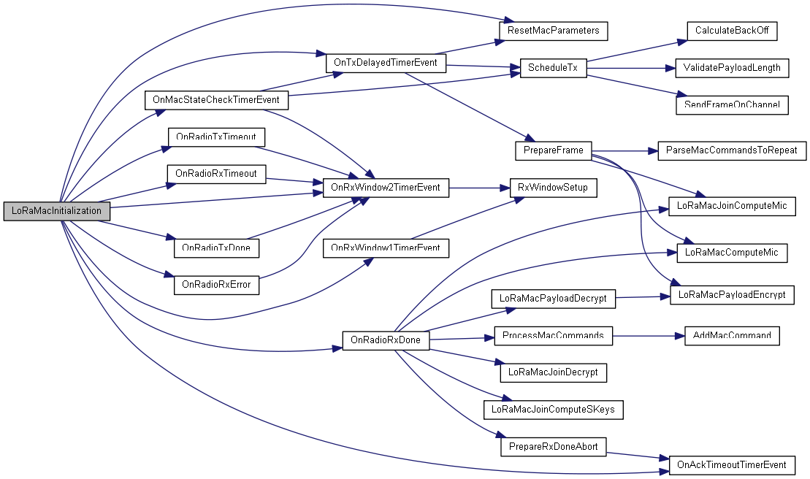

Report 1
---

## Study

### LoRaWAN Specification

### Source Code

우리가 수정해야 할 Layer는 Layer2이다. `/Middlewares/Third_Party/Lora/Mac/LoRaMac.c` 파일을 주로 수정하게 될 것이다. `LoRaMac.c` 파일에 있는 주목해야 하는 함수들과 그 동작들을 설명하려 한다.

---

#### `LoRaMacInitialization`

아래 그래프는 해당 함수의 Call graph이다.

몇 가지 `On...`함수들을 참조하고 있는데, 이들을 핸들러로 등록하는 역할을 한다.
즉, `RX1`, `RX2` 등이 끝났을 때 작동을 수정하고 싶다면 해당하는 `OnRadioRxDone`등을 수정하면 된다.
또한 Global Timer 등이 필요할 경우 이 함수에서 작동시키면 될 것 같다.

#### `OnRadioTxDone`

이 함수에서는 Transmit이 끝났을 때의 행동을 정의한다. Join message를 보내고 난 이후에도 이 함수가 불리게 될 것이다.

#### `OnRadioRxDone`

이 함수에서는 Read가 끝났을 때의 행동을 정의한다. 역시 Join message에 대한 response도 이 곳에서 처리해야 한다.

이 외에도 각종 함수들이 많이 정의되어 있으며, Class B나 C에서 사용하는 함수들도 정의되어 있다.

---

EndNode 구현체는 `/Projects/Multi/Applications/LoRa/End_Node` 폴더에 있다. `main.c`의 `LoraTxData` 함수와, `LoadRxData` 함수를 살펴보면, 현재 구현체는 EndNode의 상태(온도 등)을 전송하고 LED 점멸 명령을 서버로 부터 받도록 하고 있다.
동작들을 추가하고 싶을 경우 `USER CODE`등으로 주석 표시된 곳들에 코드를 추가하면 될 것이다.

## Project Plan

- 11/15: Install & run end node, gateway, network server
- 11/16: Design beacon based bi-directional communications
  * Design protocol
  * Design program structure
  * Design test scenarios
- 11/22: Progress Report 2
- 11/29: Implement program
- 12/4: Test code with scenarios and modify errors
- 12/5: Performance evaluation 1
- 12/6: Progress Report 3
- 12/13: Improve performance
  * Investigate the code where to improve
  * performance evaluation to find bottleneck
- 12/17: Performace evaluation 2
- 12/18: Final Report

